# In-situ powder-flow sensor for metal DED additive manufacturing

> ITS final project (*ITS Malignani*, Udine) carried out at **Joanneum Research** (Austria), **2019–2020**:
> an **in-situ sensor** to measure, and ultimately close the loop on, the **metal powder mass-flow** that feeds a **laser Directed Energy Deposition (DED / LMD)** process.

> ℹ️ **Note.** This is my own account of the engineering, with my own design artifacts. It is honest about what was *tested* versus *proposed as future work*. The work was done within an EU-region research project (see **Acknowledgement**); the practical results remain the property of Joanneum Research and are published here with permission. The confidentiality term covering the work (a 5-year NDA signed in 2020) has expired.

## The problem

In **Directed Energy Deposition (DED)** — also called **Laser Metal Deposition (LMD)** — metal powder is carried by an Argon stream through a ~4 mm tube to the laser head, where it melts into the moving melt pool and builds the part up layer by layer on a multi-axis robot.

<table>
  <tr>
    <td width="50%" align="center">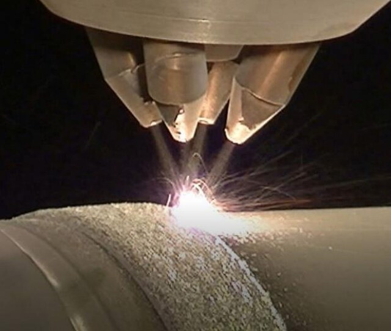</td>
    <td width="50%" align="center">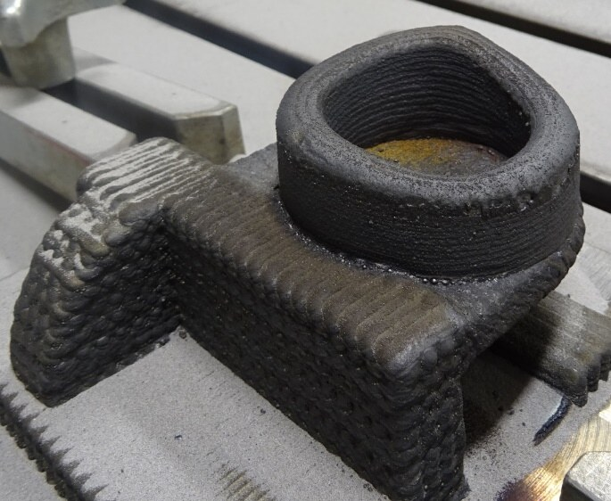</td>
  </tr>
  <tr>
    <td align="center"><em>Laser DED in action — powder blown into the melt pool builds the part.</em></td>
    <td align="center"><em>A finished DED-printed metal part.</em></td>
  </tr>
</table>

The **powder mass-flow rate** (typically **2.5–50 g/min**) sets the energy delivered *per unit mass* and so directly drives deposition quality — geometry, density, dilution. But it is hard to measure **in situ**:

- the "fluid" is a **heterogeneous solid–gas mix** (Argon-to-powder volume ratio ≈ **99:1**) — a tiny mass of powder in a lot of gas;
- the feeder emits **irregularly**, with **no fast feedback** near the head — flow can drift by **up to 30 %**.

Closed-loop control therefore needs a **high-sensitivity, high-speed** flow sensor close to the nozzle. That sensor was the goal of my internship.

## System concept

<p align="center">
  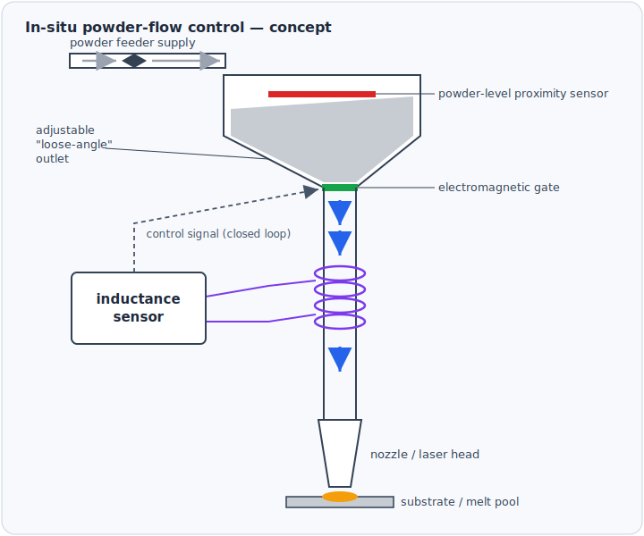<br>
  <em>Powder-flow control concept: buffered hopper with an adjustable "loose-angle" outlet, an electromagnetically-actuated gate, and an <strong>inductance sensor</strong> (sensing coil around the delivery tube) feeding the flow signal back to the controller.</em>
</p>

<p align="center">
  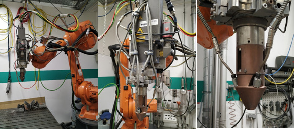<br>
  <em>The target process: an <strong>ABB IRB 4600</strong> robot carrying a <strong>3–6 kW Nd:YAG</strong> laser-DED head with coaxial powder feeding — the cell where the sensor was developed. <sub>Photo © Joanneum Research, used with permission.</sub></em>
</p>

## Sensing approaches I tested

I started from a systematic survey of flow-measurement physics, then narrowed by **sensitivity** and **speed** down to the **magnetic** and **optical** families.

**Test conditions:** GTV powder feeder, stainless steel **316L** and nickel alloy **Inconel 625** (45–100 µm), **6.5–22.5 g/min**, Argon carrier 5 l/min.

The **magnetic / RF path**, in four iterations:

1. **Inductance measurement** — a small sensing coil (5 turns, ⌀7.5 mm, 22 mm; `L = µN²S/l`); the powder inside changes the permeability. *Result: the change was far too small for a cheap LCR meter to resolve.*
2. **Frequency-shift** — make the coil the inductor of a **Colpitts LC oscillator** (`f₀ = 1/2π√(LC)`), so a tiny ΔL becomes a measurable Δf. *Result: ~2 kHz of signal, but unstable — 200–300 Hz jitter from the intermittent particle stream.*
3. **Super-heterodyne + Faraday cage** — borrow the radio-receiver principle (local oscillator → fixed IF) to pull out the small shift, the circuit shielded in a metal box. *Result: clean on/off detection, but flow-rate changes still hard to resolve.*
4. **Magneto-acoustic, PLL-stabilized** — the approach that worked: correlate the coil's self-inductance change with an **audible signal (0–22 kHz)**, with the base frequency locked by a **PLL** (87.7 MHz) feeding an SMD super-heterodyne module directly (no over-air path, no spurious fields). *Result: **valid** — sensitive enough to resolve powder-flow variations (see Results).*

**The realized sensing chain.** The coil is the inductor of a **Colpitts LC oscillator**; as powder shifts its inductance the oscillator frequency moves, and a frequency meter + microcontroller turn that into the flow reading shown on the LCD.

<table>
  <tr>
    <td width="58%" align="center">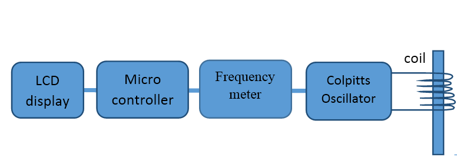</td>
    <td width="42%" align="center">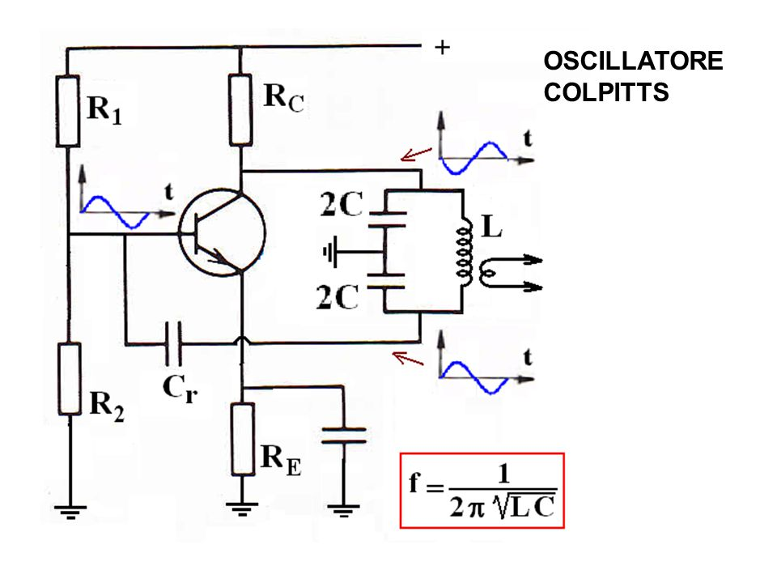</td>
  </tr>
  <tr>
    <td align="center"><em>Sensing chain: coil → Colpitts oscillator → frequency meter → microcontroller → LCD.</em></td>
    <td align="center"><em>The Colpitts oscillator — the sensing coil is its inductor <strong>L</strong>.</em></td>
  </tr>
</table>

<table>
  <tr>
    <td width="50%" align="center">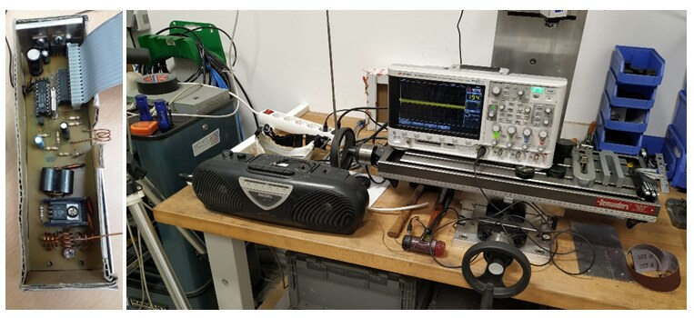</td>
    <td width="50%" align="center">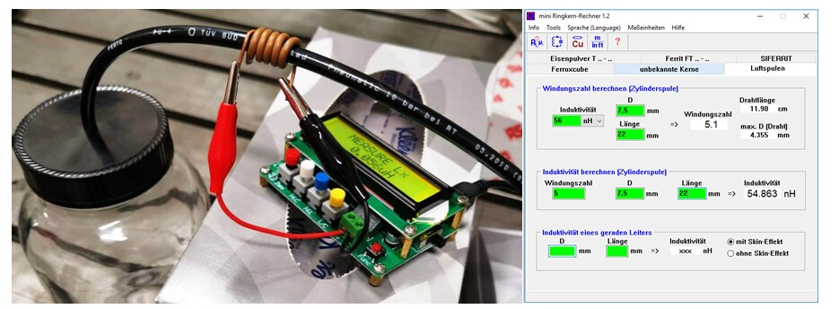</td>
  </tr>
  <tr>
    <td align="center"><em>Test bench: sensor circuit, oscilloscope and radio receiver.</em></td>
    <td align="center"><em>Sensing coil + board, with the inductor-design tool used to dimension the coil.</em></td>
  </tr>
</table>

<p align="center">
  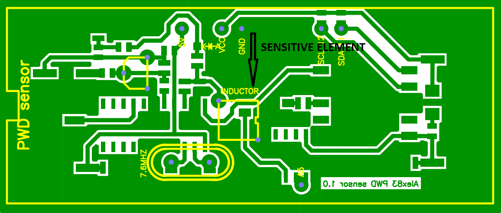<br>
  <em>My PWD-sensor board — the sensing element is the on-board <strong>inductor</strong>, read out by a stabilized RF oscillator (signed "Alex83 PWD sensor 1.0").</em>
</p>

In parallel I designed an **optical** path — a 3 mW **laser diode** (650 nm) and an **avalanche photodiode** across a transparent tube, reading absorption + scattering of the passing powder. Component supply was slowed by COVID-19, so this was only taken to **preliminary** tests (see Future work).

## Results

The **magneto-acoustic, PLL-stabilized** sensor is the one that worked — validated three ways.

**1 — the acoustic signal grows with the powder flow:**

<p align="center">
  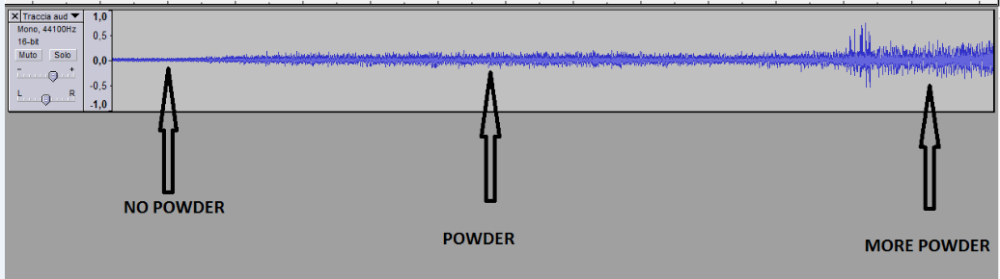<br>
  <em>Sampled sensor signal: its amplitude rises from <strong>no powder</strong> → <strong>powder</strong> → <strong>more powder</strong>.</em>
</p>

**2 — its FFT peak tracks the flow rate:**

<p align="center">
  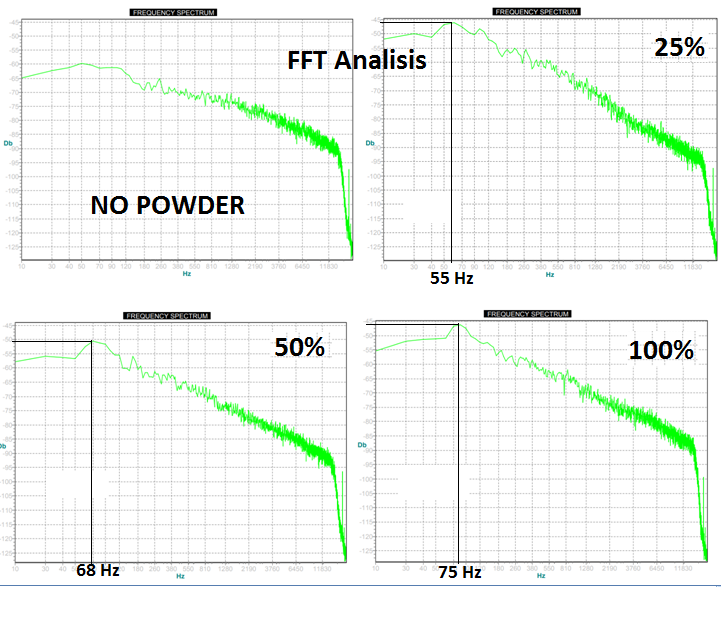<br>
  <em>FFT at no powder → 25 % → 50 % → 100 % feed: the peak moves 55 → 68 → 75 Hz.</em>
</p>

**3 — the inductance change is linear in the mass-flow:**

<p align="center">
  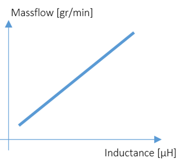<br>
  <em>Mass-flow vs. coil inductance — a clean linear relationship.</em>
</p>

Honest limitations, and where the signal fights noise:

- **inductance alone** is too small to resolve with a cheap meter;
- **Argon is diamagnetic** (µ < 1) and the powder is only ~0.04 % of the flow volume, so the gas tends to mask the powder's contribution;
- **environmental magnetic fields and vibration** add noise that can swamp the flow signal without shielding.

## Prototype & firmware

When COVID-19 closed access to the production DED cell, I **built a benchtop powder feeder** to keep experimenting off-site: a vibrating-sheet feeder (no carrier gas) dropping powder through the PWD sensor, driven by an **Arduino UNO**.

<table>
  <tr>
    <td width="50%" align="center">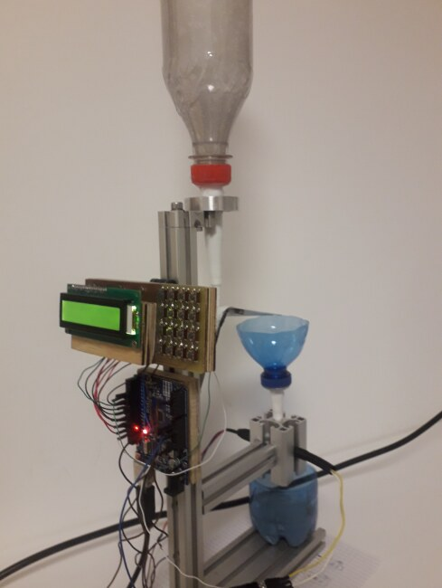</td>
    <td width="50%" align="center"></td>
  </tr>
  <tr>
    <td align="center"><em>Benchtop prototype: reservoir, vibrating feeder, sensor board and LCD.</em></td>
    <td align="center"><em>Powder metered through the sensor, PID setpoint on the LCD.<br>▶ <a href="docs/video/prototype-demo.mp4">Full demo video</a></em></td>
  </tr>
</table>

The controller firmware ([`firmware/powder_flow_controller/`](firmware/powder_flow_controller)) runs on an **Arduino UNO**: an LCD + keypad menu to pick the **powder material** (steel, titanium, Inconel, …), set the **flow setpoint** (g/min), drive the **vibrating feeder** (PWM), read the **photodiode**, and close the loop with a **PID** mode. A more connected build on an **Arduino MKR WiFi 1010** (Bluetooth / WiFi / USB / Ethernet, **Modbus TCP**, SD logging) was planned for the full system.

## Future work

Directions I would have taken next, had the internship continued:

- **Dual-oscillator differential front-end** — the powder signal is masked by Argon's diamagnetism; running a **second, reference oscillator** and subtracting it instant-by-instant should cancel the gas term and leave only the powder's contribution. I drew up a **theremin-derived** heterodyne front-end for exactly this (a theremin already beats two LC oscillators) — **designed, not yet built:**

<table>
  <tr>
    <td width="55%" align="center">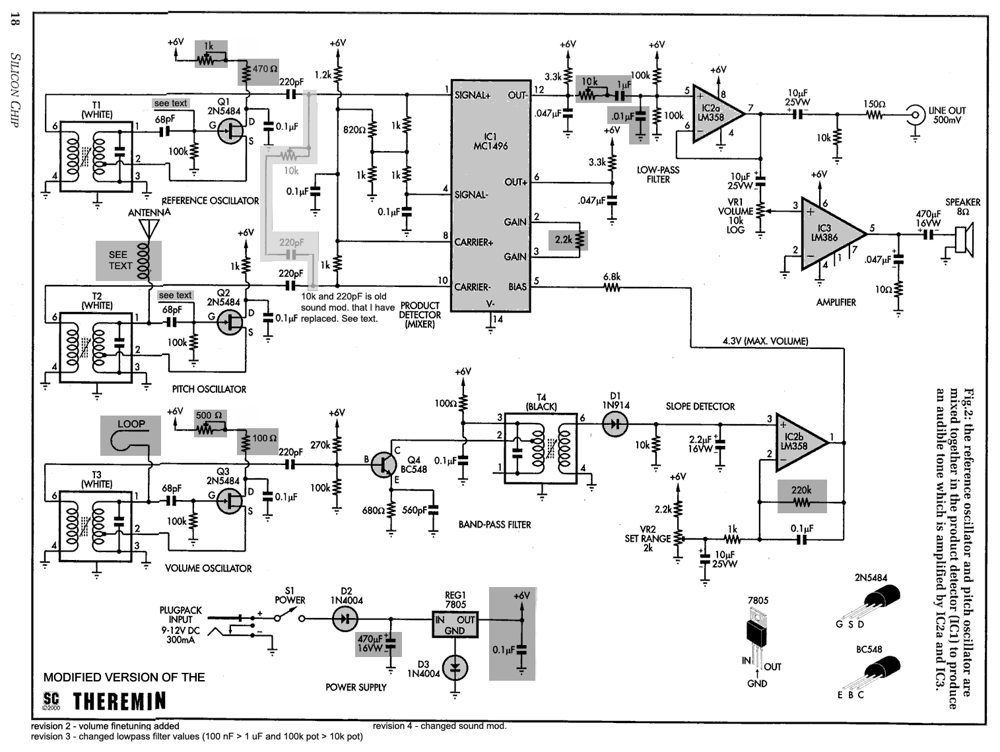</td>
    <td width="45%" align="center">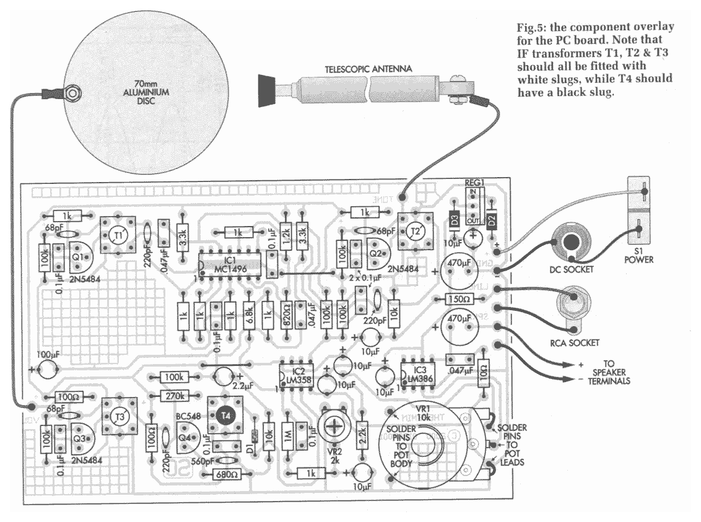</td>
  </tr>
  <tr>
    <td align="center"><em>Proposed dual-oscillator (theremin-derived) sensor circuit.</em></td>
    <td align="center"><em>PCB component placement for the proposed front-end.</em></td>
  </tr>
</table>

- **Better shielding** against environmental magnetic / vibration noise.
- **Optical path** with a **square-section tempered-glass tube** that self-cleans as the powder passes, to stop the fouling that limited the laser/photodiode setup:

<p align="center">
  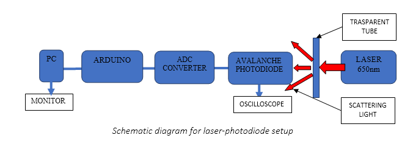<br>
  <em>Designed optical readout: laser (650 nm) → transparent tube → avalanche photodiode → ADC → Arduino.</em>
</p>

## Skills demonstrated

**Embedded** (PIC, Arduino UNO/MKR) · **RF & analog** (Colpitts oscillators, PLL, super-heterodyne, frequency/impedance measurement) · **sensor & signal conditioning** · **control systems** (PID, closed-loop) · **mechatronics** (PWM actuation, custom feeder) · **CAD** (Autodesk Inventor) and **PCB design** · **metal additive manufacturing** (DED/LMD & PBF on a 6-axis robot; certified *Additive Manufacturing Operator*, Bureau Veritas Italia 2020) · **research method** (method selection, prototyping, honest evaluation).

## Repository layout

```text
firmware/powder_flow_controller/   Arduino sketch — LCD/keypad menu, PID, vibrator, photodiode
hardware/schematics/               theremin-derived dual-oscillator (future-work design): schematic + PCB
docs/                              full ITS report + presentation (PDF)
docs/images/                       process & robot photos, schematics, experimental setups, results, demo GIF
docs/video/                        prototype demo (MP4)
```

## Context

ITS final project for the **"Tecnico Superiore per l'Automazione ed i Sistemi Meccatronici (Additive Manufacturing)"** course (**ITS Malignani**, Udine), carried out during a research internship at **Joanneum Research** (Austria), **2019–2020**. This was the start of my path into embedded & sensor engineering, which then continued at Leonardo (radar integration & validation) and across the projects below.

📄 **Full documentation:** the complete [ITS final report](docs/ITS-final-report.pdf) (25 pages) and the [project presentation](docs/presentation.pdf).

## Acknowledgement

This work was carried out within the **QuaL-DED** project (*"Total control of laser-based additive manufacturing for zero-defect metal components"*), funded by the **Austrian Research Funding Agency (FFG)** under grant **877386** (*Produktion der Zukunft*), at **Joanneum Research** (Niklasdorf, Austria), under the supervision of **Dr. V. Petrović-Filipović**. The practical results of this work remain the property of **Joanneum Research Forschungsgesellschaft mbH** and are shared here with permission.

## Author

**Alessandro Corgiolu** — System / Embedded Integration & Validation Engineer
GitHub [@corgiolu-labs](https://github.com/corgiolu-labs) · part of a hardware portfolio that includes [JONNY5](https://github.com/corgiolu-labs/jonny5) (VR-teleoperated 6-DoF arm), the [UAV LoRa transponder](https://github.com/corgiolu-labs/uav-lora-transponder), [ESP32 radar](https://github.com/corgiolu-labs/esp32-radar-tracking) and [RASPYNVERTER](https://github.com/corgiolu-labs/raspinverter).
